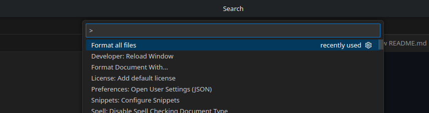
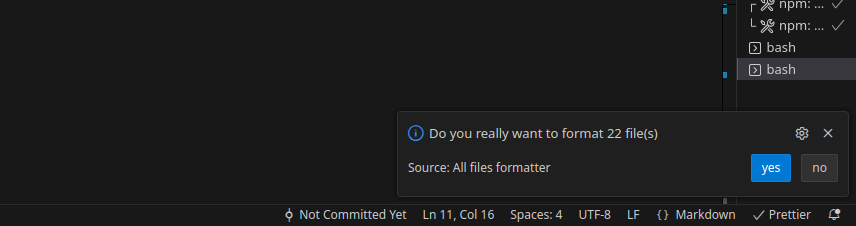
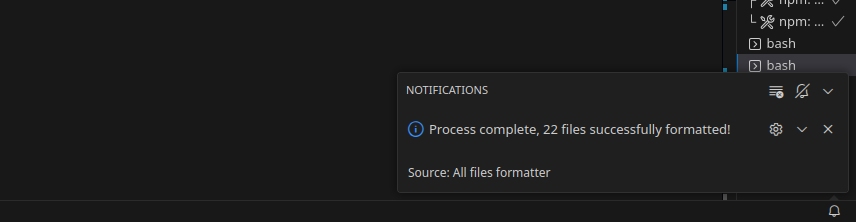

# All Files Formatter

Format all files in your workspace, the right way.

## Features

Run the command `AFF: Format all files` to format all the files in the workspace, **But ignore the same files as your `gitignore` file**.

It is really simple:, just install the extension, run the command, confirm, and thats it

Check this out:

### step 1

Hit `ctrl + shift + p` to open the command palette, and search for `format all files`, you'll see command above

### step 2

A pop-up window will show up, asking you to confirm the action. If you don't have a default formatter, the extension will ask you to choose/install one.

> Note: You still need to have a formatter for each type of file you want to format, as `Prettier` for js/ts

### step 3

The extension will automatically open, format, and close all the files for you, ignoring the same files in your `.gitignore` file.

## Extension Settings

This extension contributes the following settings:

_`Automatically close files`_: Should we close each file after it is formatted?  
_`ignore pattern`_: Add more ignore patters so those files also get ignored.  
_`Include Gitignore`_: Check the `.gitignore` file to ignore the same files as git does.  
_`Include pattern`_: Add more ignore patters so those files get included.

## Known Issues

Please check [the github repo](https://github.com/th3pool/all-files-formatter)

## Release Notes

Please see [changelog](./CHANGELOG.md) for notes

## Special thanks to

[MindWords](https://www.flaticon.com/authors/mindworlds) For the awesome [icon](./resources/main.png) for this extension
